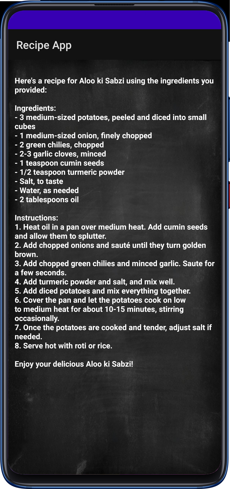

# Recipe App


## Overview
The Recipe App is an Android application that helps users discover and cook delicious meals by selecting available ingredients. It's designed to make cooking easier and more enjoyable, trying recipes right from their Android device.

### Download the APK
To download and install the APK directly on your Android device, click [here](https://github.com/yourusername/Recipe-Suggester/releases/download/v1.0/RecipeApp.apk).

## Features
- Select multiple ingredients from a list of available options.
- Suggest recipes based on the selected ingredients.
- Display recipes and instructions for cooking various dishes.
- Reset ingredient selections with a single click.

## Usage
1. Open the app on your Android device.
2. Select ingredients from the list by checking the checkboxes.
3. Tap the "Suggest Recipe" button to get personalized recipe suggestions.
4. View detailed recipe instructions and enjoy cooking your favourite dishes!

## Screenshots

<div style="display: flex; justify-content: center;">
  
  
</div>

### Prerequisites
- Android Studio
- Android Device or Emulator running Android 5.0 (Lollipop) or higher

### Installation

1. **Clone the repository:**
   ```bash
   git clone https://github.com/your-username/your-repository.git
   ```
   
2. **Open the project in Android Studio:**
   
3. **Build and run the app on your Android device or emulator.**

## Contributing
You are welcome to contribute to enhancing the Recipe App project! Feel free to fork the repository, make your changes, and submit a pull request.
